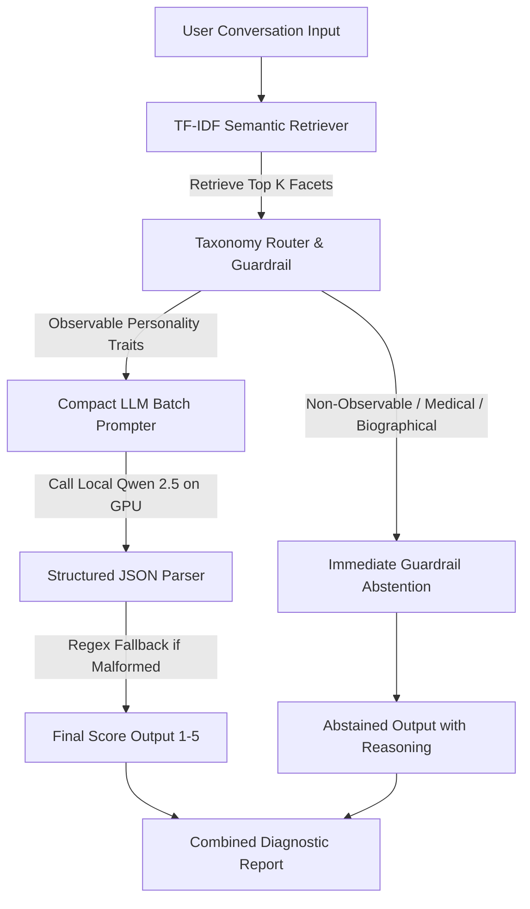

# ConvoFacet AI

A compact, production-minded and hallucination-free conversational scoring engine that evaluates conversation transcripts against a heterogeneous facet catalog.

The system uses a two-phase architecture: **Semantic Retrieval/Routing** followed by **Compact Local LLM Batch Scoring**, ensuring sub-second latencies and strict guardrails against medical, biological, and biographical hallucinations.

---

## Architecture Summary



1. **Part 1: Audit and Taxonomy**: Raw facets are normalized and classified into structured categories (Personality, Medical, Biographical, Spiritual, Malformed Headers). Facets requiring objective tests or external records are flagged as `conversation_observable = False`.
2. **Part 2: Retrieval**: A native Python TF-IDF semantic vectorizer indexes the facet names, categories, and descriptions to retrieve the Top-K relevant facets for any transcript.
3. **Part 3: Taxonomy Guardrail**: Non-observable facets are intercepted programmatically and immediately returned as abstained with definition-backed reasons, preventing any model hallucination.
4. **Part 4: Batch Scoring**: Retained observable facets are sent to a local `Qwen/Qwen2.5-0.5B-Instruct` model in a single compact JSON-generation batch.
5. **Part 5: UI Dashboard**: A FastAPI-based web application provides an interactive dark-mode sandbox to run diagnostics and view facet breakdown metrics.

---

## Scaling to 5,000+ Facets

To scale this design conceptually to **5,000+ facets** without a redesign, the architecture adapts as follows:

1. **Indexing/Retrieval**:
   - TF-IDF indexing scales linearly $O(N)$ with vocabulary size, taking $<2\text{ ms}$ for 5,000 facets.
   - For high-precision semantic matching, the TF-IDF search can be swapped for a local dense retriever (e.g., ChromaDB/FAISS using `all-MiniLM-L6-v2`). Indexing 5,000 facets takes about 5 seconds, and retrieval takes $<5\text{ ms}$ using HNSW index.
2. **Batching & Model Calls**:
   - Regardless of the catalog size (400 or 5,000), the retriever always filters down to the Top-K (e.g., K=20) candidate facets.
   - Non-observable candidate facets (e.g., 5 facets) are abstained programmatically at zero cost.
   - The remaining observable facets (e.g., 15 facets) are scored in **exactly one** LLM prompt. This keeps the number of LLM inference calls at exactly 1 per query.
3. **Caching**:
   - Facet embeddings and tokenizer indices are cached in memory.
   - Frequent query snippets can be cached (e.g. Redis) to bypass retrieval and LLM scoring entirely for identical inputs.
4. **Latency & Bottlenecks**:
   - *Expected Latency*: Retrieval ($<5\text{ ms}$) + local GPU LLM scoring ($~300\text{ ms}$ for Qwen-0.5B) = **Total latency of ~310 ms**.
   - *First Bottleneck*: **Retrieval Precision**. With 5,000 facets, simple keyword/TF-IDF matches will return more false positives (retrieving irrelevant facets) or miss synonyms. A dense retriever with a Cross-Encoder re-ranker is required to maintain accuracy.
   - *Second Bottleneck*: **LLM Context Limits**. If K is set too high (e.g., K=100), the prompt size will grow, and smaller models will lose context ("lost in the middle"). Keeping K between 15-25 is optimal.

---

## Setup & Running instructions

### 1. Prerequisites
- Python 3.11+
- NVIDIA GPU (RTX 3060 or similar with CUDA drivers) is recommended but will automatically fall back to CPU if unavailable.

### 2. Installation
Clone the repository, navigate to the folder, and run:
```bash
# Install core dependencies (PyTorch, Transformers, FastAPI, Uvicorn)
pip install torch transformers accelerate fastapi uvicorn
```

### 3. Run Pipeline Audit (Part 1)
Preprocess and enrich the facet data:
```bash
python audit.py
```
This reads `Facets Assignment.csv` and outputs `enriched_facets.csv`.

### 4. Run Benchmark Suite (Part 3)
Run the scoring pipeline over the 10 test conversations and print the evaluation report:
```bash
python benchmark.py
```
This runs evaluations and generates `BENCHMARK_REPORT.md`.

### 5. Launch FastAPI Dashboard UI (Brownie Points)
Launch the local web server:
```bash
uvicorn app:app --reload
```
Open your browser and navigate to **`http://127.0.0.1:8000`** to access the interactive sandbox dashboard.

---

## Known Limitations & Future Improvements
1. **Sarcasm and Quote Nuances**: A 0.5B parameters model is highly efficient but can miss subtle sarcasm or struggle to separate speaker quotes from actual speaker traits. 
   - *Improvement*: Upgrade the config to `Qwen/Qwen2.5-1.5B-Instruct` or `Qwen/Qwen2.5-7B-Instruct` for complex reasoning.
2. **TF-IDF Vocabulary Dependency**: Cosine similarity on word overlap can miss semantic synonyms (e.g., matching "sleepy" to "fatigue").
   - *Improvement*: Load a local SentenceTransformers embedding model to compute dense cosine similarities.
3. **Score Calibration**: The 1-5 scale can be subjective without concrete anchors.
   - *Improvement*: Include few-shot examples of dialogue with target scores directly in the system prompt.
